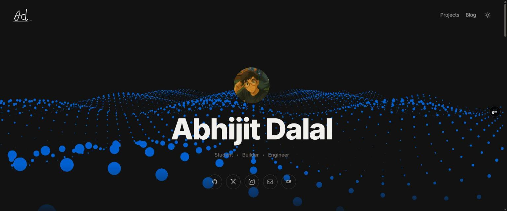

<p align="center">
  
</p>

<h1 align="center">abhijit dalal / portfolio</h1>

<p align="center">
  Personal portfolio and blog — built with Next.js 16, Tailwind CSS v4, and MDX.
</p>

<p align="center">
  <a href="https://abhijitdalal.vercel.app"></a>
  
  
  
  <a href="LICENSE"></a>
</p>

## Features

- **Three.js particle wave hero** on the homepage, plus a "Currently Working On" section and a reverse-chronological project timeline
- **Data-driven project pages** — every `/projects/<slug>` route is rendered from a single shared template (`app/projects/[slug]/page.tsx`) driven entirely by `lib/projects.ts`. No per-project page files to maintain
- **MDX blog** with frontmatter parsing, an auto-generated table of contents, and clickable anchor links on every heading
- **Light/dark theme toggle** with a circular reveal animation using the View Transitions API, falling back to an instant switch on unsupported browsers
- Scroll-reveal animations via a dependency-free `IntersectionObserver` wrapper — SSR-safe and `prefers-reduced-motion`-aware
- Auto-generated `sitemap.xml` and `robots.txt` covering every post and project

## Stack

| | |
|---|---|
| Framework | [Next.js 16](https://nextjs.org) (App Router, Turbopack) |
| Styling | [Tailwind CSS v4](https://tailwindcss.com) — theme tokens live in `app/globals.css` via `@theme`, no `tailwind.config.js` |
| Content | [next-mdx-remote/rsc](https://github.com/hashicorp/next-mdx-remote) for MDX-as-RSC, `rehype-slug` + `rehype-autolink-headings` for heading anchors, `gray-matter` for frontmatter |
| Theming | [next-themes](https://github.com/pacocoursey/next-themes) — `class`-based, defaults to OS preference |
| 3D / animation | Three.js (`@tsparticles`) for the hero background, `framer-motion` for page transitions |
| Analytics | Vercel Analytics + Speed Insights |

## Project structure

```
app/
  layout.tsx              # Root layout — theme provider, nav, footer
  page.tsx                 # Home: wave hero, current projects, timeline, blog list
  projects/
    page.tsx                # Full project list
    [slug]/page.tsx          # Shared, data-driven project detail template
  blog/
    page.tsx                 # Blog post list
    [slug]/page.tsx           # MDX post renderer + TOC sidebar
  about/page.tsx            # Bio + scrolling marquee strips
  sitemap.ts, robots.ts     # SEO
components/                 # Nav, Footer, ProjectCard, Toc, WaveBg, FadeUp, ...
content/blog/                # MDX source files
lib/
  projects.ts                # Single source of truth for every project card + page
  posts.ts                    # Blog post loading (frontmatter + content)
  toc.ts                       # Heading extraction for the blog TOC
```

## Development

```bash
npm install
npm run dev      # http://localhost:3002
npm run build    # production build
npm run lint
```

## Adding a blog post

Create `content/blog/<slug>.mdx`:

```mdx
---
title: "Post Title"
date: "2026-06-15"
description: "One sentence for SEO and the post list."
---

Content here. Any `##` heading automatically gets a table-of-contents
entry and a clickable anchor — nothing else to wire up.
```

Posts are sorted newest-first and picked up automatically by both the homepage "Blog" section and `/blog`.

## Adding a project

Add an entry to the `projects` array in `lib/projects.ts`:

- `status: "current"` → shown under "Currently Working On"
- `status: "done"` → shown in the timeline

Higher `order` sorts more recently. Each project's write-up is split for two audiences at once — a casual reader after the "what is this and why is it cool" hook (`story`), and a recruiter evaluating actual skill (`howItWorks`, `architectureSteps`, `diagrams`, `papers`). The detail page at `/projects/<slug>` is generated automatically — no per-project files needed. Drop project media into `public/projects/<slug>/`.

## Deploy

Connected to Vercel — pushing to `main` auto-deploys to production.

```bash
git push origin main
```

## License

[MIT](LICENSE)
